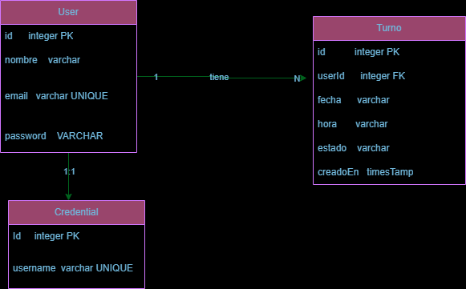

# MediTom 🏥

Sistema de gestión de turnos médicos — aplicación full stack con autenticación JWT y base de datos PostgreSQL.

---

## Descripción

MediTom permite a los pacientes registrarse, iniciar sesión y gestionar sus citas médicas de forma online. Los usuarios pueden agendar turnos, consultar su historial y cancelar citas desde cualquier dispositivo.

---

## Tecnologías

### Backend
| Tecnología | Versión | Uso |
|---|---|---|
| Node.js | 18+ | Entorno de ejecución |
| TypeScript | 5.9 | Lenguaje principal |
| Express | 5.2 | Framework HTTP |
| TypeORM | 0.3 | ORM para PostgreSQL |
| PostgreSQL | 14+ | Base de datos |
| bcryptjs | 3.0 | Hashing de contraseñas |
| jsonwebtoken | 9.0 | Autenticación JWT |
| morgan | 1.10 | Logger de requests |

### Frontend
| Tecnología | Versión | Uso |
|---|---|---|
| React | 19 | Librería UI |
| Vite | 7 | Bundler |
| Tailwind CSS | 3.4 | Estilos |
| React Router DOM | 7 | Navegación |
| Axios | 1.13 | Peticiones HTTP |
| Framer Motion | 12 | Animaciones |
| Lucide React | 0.577 | Iconos |
| SweetAlert2 | 11 | Alertas |

---

## Estructura del proyecto

```
PM3-SarhenRamirez/
├── back/
│   └── src/
│       ├── config/
│       │   └── envs.ts
│       ├── controllers/
│       │   ├── auth.controller.ts
│       │   └── turnos.controller.ts
│       ├── data/
│       │   └── app.datasource.ts
│       ├── entities/
│       │   ├── Credential.ts
│       │   ├── Turno.ts
│       │   └── User.ts
│       ├── middleware/
│       │   ├── auth.ts
│       │   └── error.middleware.ts
│       ├── routes/
│       │   ├── auth.routes.ts
│       │   ├── turnos.routes.ts
│       │   └── usuarios.routes.ts
│       ├── services/
│       │   └── turnos.service.ts
│       ├── types/
│       │   └── express/index.d.ts
│       └── server.ts
├── front/
│   └── src/
│       ├── components/
│       │   ├── Layout.jsx
│       │   ├── Loader.jsx
│       │   ├── Navbar.jsx
│       │   └── ProtectedRoute.jsx
│       ├── context/
│       │   ├── TurnosContext.jsx
│       │   └── UserContext.jsx
│       ├── services/
│       │   └── api.js
│       └── views/
│           ├── Home.jsx
│           ├── Login.jsx
│           ├── MisTurnos.jsx
│           ├── NuevoTurno.jsx
│           ├── Perfil.jsx
│           └── Register.jsx
└── docs/
    └── diagrama-er.png
```

---

## Instalación y configuración

### Requisitos previos

Antes de comenzar, asegurese de tener instalado lo siguiente en tu sistema:

- **Node.js** v18 o superior → [nodejs.org](https://nodejs.org)
- **npm** v9 o superior (viene incluido con Node.js)
- **PostgreSQL** v14 o superior → [postgresql.org](https://www.postgresql.org/download)
- **Git** → [git-scm.com](https://git-scm.com)

Para verificar que todo está instalado correctamente, puede ejecutar:

```bash
node --version    # Debe mostrar v18.x.x o superior
npm --version     # Debe mostrar 9.x.x o superior
psql --version    # Debe mostrar PostgreSQL 14.x o superior
git --version
```

---

### 1. Clonar el repositorio

```bash
git clone https://github.com/SarhenRamirez/PM3-SarhenRamirez.git
cd PM3-SarhenRamirez
```

---

### 2. Configurar el backend

#### 2.1 Instalar dependencias

```bash
cd back
npm install
```

#### 2.2 Crear el archivo de variables de entorno

En la carpeta `back/`, crea un archivo llamado `.env`. Podés hacerlo manualmente o con el siguiente comando:

```bash
# En Linux/Mac
touch .env

# En Windows (PowerShell)
New-Item .env
```

Luego abra el archivo y pegue el siguiente contenido, **reemplazando los valores** según tu configuración local:

```env
PORT=3000

DB_HOST=localhost
DB_PORT=5432
DB_USER=postgres
DB_PASSWORD=tu_contraseña_de_postgres
DB_NAME=meditom

JWT_SECRET=una_cadena_larga_aleatoria_y_secreta
```

**¿Qué significa cada variable?**

| Variable | Descripción | Ejemplo |
|---|---|---|
| `PORT` | Puerto donde corre el servidor backend | `3000` |
| `DB_HOST` | Host de la base de datos (local por defecto) | `localhost` |
| `DB_PORT` | Puerto de PostgreSQL (5432 por defecto) | `5432` |
| `DB_USER` | Usuario de PostgreSQL | `postgres` |
| `DB_PASSWORD` | **Tu contraseña personal de PostgreSQL** | `miPassword123` |
| `DB_NAME` | Nombre de la base de datos a crear | `meditom` |
| `JWT_SECRET` | **Clave secreta para firmar tokens JWT** — usá cualquier string largo | `s3cr3t0_sup3r_l4rg0_xyz` |

> ⚠️ **Importante:** El archivo `.env` ya está incluido en `.gitignore`, por lo que **no se subirá al repositorio**. Cada persona que clone el proyecto debe crear su propio `.env` con sus datos personales.

---

### 3. Crear la base de datos en PostgreSQL

#### Opción A — Desde la terminal

```bash
psql -U postgres -c "CREATE DATABASE meditom;"
```

Si PostgreSQL te pide contraseña, ingrese la que configuraste al instalar PostgreSQL (la misma que pusiste en `DB_PASSWORD`).

#### Opción B — Desde pgAdmin (interfaz gráfica)

1. Abra pgAdmin
2. Haga clic derecho en **Databases** → **Create** → **Database...**
3. En el campo **Database**, escriba `meditom`
4. Haga clic en **Save**

> ✅ Las tablas se crean automáticamente cuando levanta el servidor por primera vez, gracias a la configuración `synchronize: true` de TypeORM.

---

### 4. Configurar el frontend

```bash
# Desde la raíz del proyecto
cd front
npm install
```

El frontend no requiere variables de entorno adicionales para correr en desarrollo. La URL del backend ya está configurada en `src/services/api.js` apuntando a `http://localhost:3000`.

---

## Ejecución

Es necesario tener **dos terminales abiertas** de forma simultánea: una para el backend y otra para el frontend.

### Terminal 1 — Backend

```bash
cd back
npm run dev
```

El servidor estará disponible en `http://localhost:3000`.  
Deberia ver un mensaje como: `Server running on port 3000` y la confirmación de conexión con PostgreSQL.

### Terminal 2 — Frontend

```bash
cd front
npm run dev
```

La aplicación estará disponible en `http://localhost:5173`.  
Abra esa URL en tu navegador para usar la aplicación.

---

## Endpoints de la API

### Autenticación

| Método | Endpoint | Auth | Descripción |
|---|---|---|---|
| `POST` | `/api/auth/register` | No | Registrar nuevo usuario |
| `POST` | `/api/auth/login` | No | Iniciar sesión — devuelve JWT |

### Turnos

| Método | Endpoint | Auth | Descripción |
|---|---|---|---|
| `POST` | `/api/turnos` | JWT | Crear turno |
| `GET` | `/api/turnos/mis-turnos` | JWT | Obtener turnos del usuario |
| `GET` | `/api/turnos/:id` | JWT | Obtener turno por ID |
| `PATCH` | `/api/turnos/:id/cancelar` | JWT | Cancelar turno |

### Usuarios

| Método | Endpoint | Auth | Descripción |
|---|---|---|---|
| `GET` | `/api/usuarios/perfil` | JWT | Ver perfil del usuario logueado |

---

## Autenticación

El sistema usa **JSON Web Tokens (JWT)**. Al hacer login, el servidor devuelve un token que debe enviarse en el header de cada petición protegida:

```
Authorization: Bearer <token>
```

El token expira en **24 horas**.

---

## Modelo de datos



### User
| Campo | Tipo | Descripción |
|---|---|---|
| `id` | `integer PK` | Identificador único |
| `nombre` | `varchar` | Nombre del usuario |
| `email` | `varchar UNIQUE` | Email — usado para login |
| `password` | `varchar` | Contraseña hasheada con bcrypt |

### Turno
| Campo | Tipo | Descripción |
|---|---|---|
| `id` | `integer PK` | Identificador único |
| `userId` | `integer FK` | Referencia al usuario dueño |
| `fecha` | `varchar` | Fecha en formato `YYYY-MM-DD` |
| `hora` | `varchar` | Hora en formato `HH:mm` |
| `estado` | `varchar` | `agendado` o `cancelado` |
| `creadoEn` | `timestamp` | Fecha de creación del registro |

### Credential
| Campo | Tipo | Descripción |
|---|---|---|
| `id` | `integer PK` | Identificador único |
| `username` | `varchar UNIQUE` | Nombre de usuario |

---

## Reglas de negocio

- Solo se pueden agendar turnos a partir del **día siguiente**
- No se permiten turnos en **fines de semana**
- El horario disponible es de **06:00 a 17:00**
- No puede haber **dos turnos en el mismo horario**
- Solo el **dueño del turno** puede cancelarlo
- No se pueden cancelar turnos de **fechas pasadas**

---

## Scripts disponibles

### Backend

| Script | Descripción |
|---|---|
| `npm run dev` | Inicia el servidor en modo desarrollo con nodemon |
| `npm run build` | Compila TypeScript a JavaScript |
| `npm start` | Inicia el servidor compilado en producción |

### Frontend

| Script | Descripción |
|---|---|
| `npm run dev` | Inicia Vite en modo desarrollo |
| `npm run build` | Genera el build de producción |
| `npm run preview` | Previsualiza el build de producción |
| `npm run lint` | Ejecuta ESLint |

---

## Solución de problemas frecuentes

**Error: `password authentication failed for user "postgres"`**  
→ La contraseña en `DB_PASSWORD` del `.env` no coincide con la de tu instalación de PostgreSQL. Verifique que sea correcta.

**Error: `database "meditom" does not exist`**  
→ No se creó la base de datos todavía. Ejecute el paso 3 de la instalación.

**Error: `EADDRINUSE: address already in use :::3000`**  
→ El puerto 3000 ya está siendo usado por otro proceso. Cambie `PORT` en el `.env` a otro valor (ej: `3001`) o cierre el proceso que lo está ocupando.

**El frontend no se conecta al backend**  
→ Asegurate de que el backend esté corriendo en `http://localhost:3000` antes de usar el frontend.

---

## Autor

Desarrollado por **Sarhen Ramirez** — Proyecto PM3
